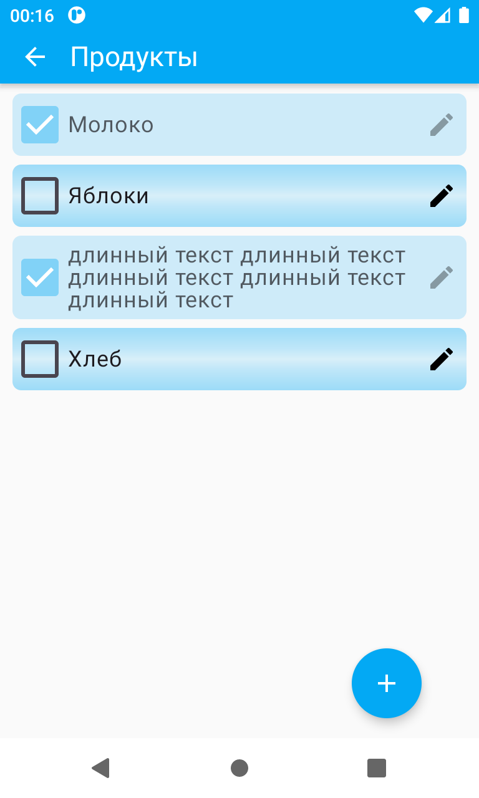

# my-todo

Приложение позволяет создавать списки дел

|                                     |                                                |                                                                        |
|-------------------------------------|------------------------------------------------|------------------------------------------------------------------------|
|  |  |  |

* Списков может быть неограниченное число
* Списки можно добавлять/удалять/редактировать
* Списки можно переупорядочивать, перетаскивая элементы в нужные позиции

## Ключевые особенности реализации
* Jetpack Compose
* MVI - паттерн Model-View-Intent с соблюдением Unidirectional Data Flow
* Реактивный подход с использованием kotlin.Flow для наблюдения за состоянием экранов приложения
* Hilt (dependency injection)
* Sqlite (Room) для хранения данных
* Unit tests (kotest, mockk, robolectric)
* Поддержка русского и английского языков
* Использована кастомная анимация для вычеркивания пункта из списка
* После перезапуска приложения открывается сразу последний открытый список,
если таковой был на момент завершения приложения
* TODO: type-safe compose navigation, main hamburger menu (navigation drawer)

### MVI
ViewModel (VM) комбинирует различные flow при помощи функции combine и на выходе
для ui предоставляет screen state через StateFlow. А также VM получает от ui UserIntent'ы,
обрабатывает их и опять же формирует соответствующий ui state.

### Room
* В запросах, где необходимо, используется Flow для удобства отслеживания изменений данных на уровне БД
* Есть пример использования GROUP BY, аггрегатных функций SUM и COUNT, 
аннотации @Embedded ([TodoListDao.kt](app/src/main/java/alexx/rizz/mytodo/feature/todolist/TodoListDao.kt))